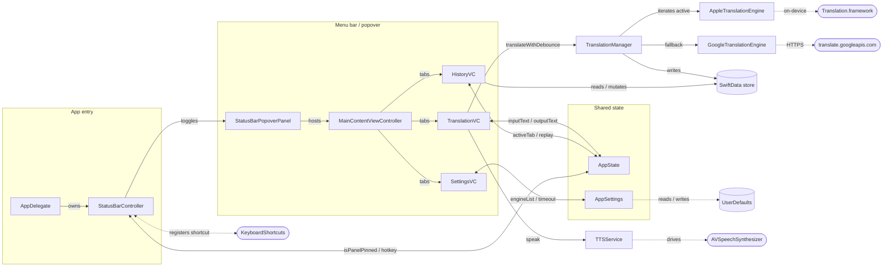

<p align="center">
  
</p>

<h1 align="center">LingoBar</h1>

<p align="center"><strong>A native macOS menu-bar translation tool. Click, translate, get back to work.</strong></p>

<p align="center">
  
  
  <br>
  
  
  
</p>

<p align="center"><a href="README.md">English</a> | <a href="README_ZH.md">中文</a></p>

---

## What is LingoBar?

LingoBar lives in your macOS menu bar. Click the icon — or hit a global hotkey (default `⌥⌘T`) — and a popover slides down with an input field already focused. Type, wait 500 ms, and the translation lands in the output field. Hit the hotkey again (or `⌘W`, or `Esc`, or click outside) to dismiss it. That's the whole product: zero configuration to start, one popover to use, never any Dock icon or window clutter.

```
   ╭─ menu bar ───────────────────────╮
   │  ... [🌐 LingoBar]  🔋  ⌚ 14:23  │
   ╰─────────────╲────────────────────╯
                  ▼  click / ⌥⌘T
   ┌─[ Translate │ History │ Settings ]┐
   │ Auto-detect ▾                     │
   │  Bonjour le monde            📋🔊 │
   │ ─────────────────────────── 🍎 Apple
   │ Auto ▾                            │
   │  Hello world                 📋🔊 │
   └───────────────────────────────────┘
```

## Features

- **Pure native, no WebView** — Swift 6 + AppKit, follows the system light/dark theme, hides from the Dock (`LSUIElement`), runs as a normal `NSStatusItem`.
- **Zero-config translation** — Apple's on-device Translation framework is enabled out of the box; Google Translate is available via its public web endpoint, no API key, no login, no card.
- **Engine fallback chain** — enable / reorder engines in Settings; on a per-request timeout (default 5 s) or error, the next checked engine takes over and its icon updates in the output header.
- **Live, debounced translation** — pause typing for ~500 ms and translation fires automatically; stop typing midway and the in-flight request is cancelled.
- **History with session aggregation** — one burst of typing produces one history row that updates in place, not a flood of partial entries. Stars float favorites to the top; cap is 500 entries with favorites exempt from eviction.
- **Pin to keep open** — a pin button locks the popover so click-outside / `Esc` won't close it, useful while reading or referencing the panel.
- **Custom in-list reorder** — engine rows are reordered with a vertical mouse-tracking drag confined to the list; nothing flies across the screen.
- **Global hotkey, customizable** — recorder lives inside the Settings tab (powered by [KeyboardShortcuts](https://github.com/sindresorhus/KeyboardShortcuts)); default `⌥⌘T`.

## Screenshots

<p align="center">
  
  
  
</p>

## Install

### macOS (15.0+, Apple Silicon)

> The app is currently distributed unsigned, ad-hoc-codesigned. macOS Gatekeeper will refuse to launch it on first attempt — bypass it once and the app will launch normally afterwards.

#### Option 1 — Right-click "Open"

1. Download the latest `LingoBar.dmg` from the Releases page and drag `LingoBar.app` into `/Applications`.
2. In Finder, right-click `LingoBar.app` → **Open**.
3. The dialog will now have an **Open** button — click it. macOS records the exception; future launches don't prompt.

#### Option 2 — System Settings

1. Double-click `LingoBar.app` once and dismiss the "cannot be opened" dialog.
2. Open **System Settings → Privacy & Security**, scroll to the bottom.
3. Click **Open Anyway** next to the LingoBar entry, then confirm in the next dialog.

#### Option 3 — Strip the quarantine attribute

```bash
# After dragging into /Applications:
xattr -cr /Applications/LingoBar.app
```

This removes the `com.apple.quarantine` extended attribute Gatekeeper reads. The app then launches like any signed app.

## Usage

- **Open / close** — click the menu-bar icon, or press the global hotkey (default `⌥⌘T`). Either action toggles the popover; both share one window instance.
- **Translate** — start typing in the input field. The translation runs ~500 ms after you stop typing. The icon on the output header shows which engine actually returned the result (engines are tried top-to-bottom from the list in Settings; any timeout/error falls through to the next).
- **Output language "Auto"** — Chinese input → English output, anything else → Chinese output. Pick a specific language to lock it.
- **Pin** — click the pin in the input toolbar to keep the popover open across click-outside / `Esc`. Pin state resets on app restart.
- **Idle retention** — close the popover and the input/output/active tab are kept for 3 minutes; reopen within that window and you pick up where you left off. Past 3 minutes, the input clears and the tab resets to Translate.
- **History** — switch to the **History** tab to search, star favorites, delete single entries, or click an entry to refill the Translate tab. "Clear all" leaves favorites alone.
- **Settings** — the right-click menu's **Settings…** opens the popover directly on the Settings tab. Toggle Launch-at-Login, change the global hotkey, edit the per-request timeout, or check / reorder the engine list (drag a row inside the list to reorder; the dragged row is locked to the vertical axis).

## Development

> macOS is the only supported development platform. The project ships an Xcode project and uses Swift Package Manager dependencies; no other-platform build instructions are provided.

### Recommended environment

| Dependency                | Version   |
| ------------------------- | --------- |
| macOS                     | 26.4.1    |
| Xcode                     | 26.4.1    |
| Xcode Command Line Tools  | 26.4.1    |

<sub>This is the environment the author develops and runs the app on, so it's known to build and run end-to-end. Lower versions may work but are not tested — no guarantees if you go below the listed versions.</sub>

### Checking and installing prerequisites

#### macOS

- **Check current version** — open **Apple menu → About This Mac**, or run `sw_vers -productVersion` in Terminal.
- **Upgrade** — **System Settings → General → Software Update** (recommended; Apple's official channel installs the matching system frameworks the project depends on).

#### Xcode + Command Line Tools

- **Check whether Xcode is installed** — open Spotlight and search for "Xcode", or run `xcode-select -p` in Terminal (a path means CLT is registered).
- **Check the Xcode version** — `xcodebuild -version`.
- **Check the CLT version** — `pkgutil --pkg-info=com.apple.pkg.CLTools_Executables`.
- **Install Xcode** — from the **Mac App Store** (recommended; auto-updates and bundles the matching CLT).
- **Install / register the Command Line Tools standalone** — `xcode-select --install`. After Xcode is installed, also run `sudo xcode-select -s /Applications/Xcode.app/Contents/Developer` once so command-line tools route to Xcode's toolchain.
- **Upgrade** — Mac App Store handles Xcode upgrades; CLT upgrades come down via **System Settings → General → Software Update**.

Swift 6.3 ships with Xcode 26 — there's no separate Swift toolchain to install. The project's SwiftPM dependency (KeyboardShortcuts) resolves automatically the first time you open the project in Xcode.

### Build and run

```bash
# 1. Clone and enter the project
git clone https://github.com/yuman07/LingoBar.git
cd LingoBar

# 2. Open in Xcode — SwiftPM will resolve KeyboardShortcuts on first open
open LingoBar.xcodeproj

# 3. From Xcode: select the LingoBar scheme and press ⌘R to build & run.
```

For a command-line Debug build without opening Xcode:

```bash
xcodebuild -project LingoBar.xcodeproj -scheme LingoBar -configuration Debug \
  -derivedDataPath build build
open build/Build/Products/Debug/LingoBar.app
```

## Technical Overview

LingoBar is a single-binary AppKit app that hides from the Dock and renders its UI inside one popover-style `NSPanel` anchored to the menu-bar status item. The popover hosts a custom segmented tab bar (Translate / History / Settings) with three sibling view controllers; tab state lives on a shared `AppState`. Translation requests are debounced in `TranslationManager`, which iterates the user's enabled engines top-to-bottom under a shared timeout, falling through on error and updating the output header's engine icon when one finally returns a result. History writes go to SwiftData with session-scoped aggregation (one burst of typing → one row that updates in place) and a 500-row cap that evicts the oldest non-favorite. Settings live in `UserDefaults`; the global hotkey is bound through Sindresorhus's `KeyboardShortcuts` package and updates the menu-item shortcut hint live.

### Tech stack

| Concern              | Choice                                                                              |
| -------------------- | ----------------------------------------------------------------------------------- |
| Platform             | macOS 15.0+ (Apple Silicon only, ARM64)                                             |
| Language             | Swift 6 with `SWIFT_STRICT_CONCURRENCY = complete`                                  |
| UI                   | AppKit (`NSViewController` / `NSView`), no SwiftUI, no WebView                      |
| Translation engines  | Apple `Translation` framework (on-device); Google `translate.googleapis.com` public endpoint |
| Persistence          | `UserDefaults` (settings); SwiftData (history)                                      |
| Global hotkey        | [KeyboardShortcuts](https://github.com/sindresorhus/KeyboardShortcuts) by Sindresorhus |
| Login item           | `ServiceManagement.SMAppService`                                                    |
| TTS                  | `AVSpeechSynthesizer`                                                               |
| Distribution         | Standalone DMG, non-sandboxed, Developer ID + Notarization (planned)                |

### Architecture



- **Main data flow** — `TranslationVC` writes the user's text into `AppState.inputText`; the `TranslationManager` subscriber debounces ~500 ms, iterates the user's active engines under a shared timeout, and writes the winner's text plus engine icon back through `AppState.outputText` / `currentEngineType`.
- **Engine fallback** — `TranslationManager` runs `AppEng → GoogleEng` (or whatever order the user configured) sequentially. Each engine has the same per-request timeout from `AppSettings.engineTimeoutSeconds`; an error or timeout drops to the next checked engine; an empty input resets the active engine to the first checked one.
- **External services** — `KeyboardShortcuts` owns the global hotkey ⇄ `StatusBarController` round-trip; the Apple `Translation` framework runs on-device and may surface a "language pack not installed" failure that the manager treats as a normal engine failure (next engine takes over).
- **Persistence** — `UserDefaults` stores everything in `AppSettings` (engine order, enable set, timeout, language preferences, hotkey id); SwiftData backs `TranslationRecord` for history and feeds the History tab's search and favorites; the two are deliberately separate so settings load instantly at launch and history never blocks the popover open.

### Source layout

```
LingoBar/
|-- LingoBarApp.swift            # @main, hands off to AppDelegate
|-- AppDelegate.swift            # NSApplicationDelegate, app-wide wiring
|-- AppState.swift               # @MainActor ObservableObject, transient runtime state
|-- AppSettings.swift            # @MainActor, UserDefaults-backed settings
|-- LingoBar.entitlements        # network.client only (no sandbox)
|-- Localizable.xcstrings        # en + zh-Hans
|-- Models/
|   |-- SupportedLanguage.swift     # 22 supported language cases + auto
|   `-- TranslationRecord.swift     # SwiftData @Model for history
|-- Services/
|   |-- TranslationEngineProtocol.swift  # engine contract + TranslationError
|   |-- TranslationManager.swift         # debounce, fallback chain, history writes
|   |-- AppleTranslationEngine.swift     # wraps Translation.framework
|   |-- AppleTranslationHost.swift       # SwiftUI host needed by the framework
|   |-- GoogleTranslationEngine.swift    # public translate.googleapis.com client
|   `-- TTSService.swift                 # AVSpeechSynthesizer wrapper
|-- StatusBar/
|   |-- StatusBarController.swift        # NSStatusItem + popover toggle + right-click menu
|   `-- StatusBarPopoverPanel.swift      # NSPanel masked into a popover shape
|-- Utilities/
|   `-- KeyboardShortcutNames.swift      # KeyboardShortcuts.Name registry
`-- Views/
    |-- MainContentViewController.swift  # tab container + custom segmented control
    |-- TranslationViewController.swift  # Translate tab
    |-- HistoryViewController.swift      # History tab (SwiftData-backed)
    |-- SettingsViewController.swift     # Settings tab top rows + pills
    |-- EngineSettingsViewController.swift  # engine list + custom in-place reorder drag
    |-- LanguagePopUpButton.swift        # custom NSPopUpButton for language picker
    `-- GrowingTextView.swift            # auto-resizing input/output text view
```

### Engine fallback algorithm

The manager treats the engine list as an ordered, partially-checked sequence. The minimum surface is small enough to spell out:

| Concept              | Source                                                | Constraint                                                       |
| -------------------- | ----------------------------------------------------- | ---------------------------------------------------------------- |
| Engine list          | `AppSettings.engineList`                              | Always contains every supported engine; user controls order.     |
| Enabled engines      | `AppSettings.enabledEngines`                          | A subset; the UI guarantees `count ≥ 1`.                         |
| Active engine        | `AppState.currentEngineType`                          | Reset to the first enabled engine whenever input becomes empty.  |
| Per-request timeout  | `AppSettings.engineTimeoutSeconds` (default 5, min 1) | Shared across engines; applied per attempt, not per chain.       |

For each translation attempt:

1. **Skip non-enabled engines** — when iterating `engineList`, drop entries that aren't in `enabledEngines`. *Why:* the order matters but disabled engines should be invisible to the chain, otherwise reordering UX would be coupled to enable/disable UX.
2. **Start from the active engine** — the first engine tried is `currentEngineType`. *Why:* a user mid-session expects translations to keep coming from the engine that just succeeded — switching engines is a "last resort" event, not a default.
3. **Fall through on failure** — error or timeout drops to the next enabled engine in `engineList` order. *Why:* the user's order is also their preference order; respecting it is more predictable than any cleverer policy (cheapest-first, fastest-first), and avoids the manager second-guessing user intent.
4. **Promote the winner** — the engine that returned the result becomes the new `currentEngineType` and its icon shows in the output header. *Why:* makes the fallback observable and gives the user a passive signal that a "preferred" engine failed; if it's wrong they can fix the order in Settings.
5. **Reset on empty input** — when input clears (manually, via the 3-minute retention expiry, or by clicking a history row that resets), `currentEngineType` resets to the first enabled engine. *Why:* a fresh translation should start at the user's top preference, not inherit a stale fallback from the previous session.
6. **All-fail surface** — if every enabled engine fails, surface `allEnginesFailed` in the output area; never silently fall back to a non-enabled engine. *Why:* the SPEC explicitly forbids hidden fallback to Apple — removing it from the enable list must really remove it from the chain, even if a network engine fails.

Complexity is `O(k)` per attempt where `k` is the number of enabled engines (≤ all supported engines, currently 2). The shared timeout lives on the manager so a slow engine can't block the chain longer than `engineTimeoutSeconds`.

### Custom in-list reorder drag

The engine list is reordered without `NSDraggingSession`, so the dragged row is locked to the vertical axis and can never escape the popover. The flow:

1. **Hit-test** — `EngineRowView.hitTest` returns `self` for any click outside the checkbox, so the row's own `mouseDown` fires for handle / icon / label / padding, while clicks on the checkbox still route to `NSButton`.
2. **Tracking loop** — `mouseDown` calls into the parent VC, which captures the start mouse-Y in window coords and the row's flipped origin-Y, then enters a `window.nextEvent(matching: [.leftMouseDragged, .leftMouseUp], inMode: .eventTracking, dequeue: true)` loop.
3. **Per-event update** — each `mouseDragged` event computes `dy = currentMouseY - startMouseY` and sets `row.frame.origin.y = startFrameY - dy`, clamped to `[0, (count-1) * rowHeight]`. Crossing another row's midpoint shifts the visual order array and animates the other rows to their new slots; the dragged row is excluded from the layout pass so its frame isn't fought.
4. **Commit on `mouseUp`** — the dragged row snaps back to its target slot via an 18 ms animation; on completion the model is mutated through `AppSettings.moveEngine(from:to:)`. The mutation is deferred so the resulting `@Published` notification doesn't yank the visual mid-snap, and the index conversion handles the "drop above row N" semantics moveEngine expects when moving downward.

The result is a drag that feels like a System-Settings-style reorder but never escapes the panel.

## FAQ

**Q: Does Google Translate need an API key?**

> No. The Google engine talks to `translate.googleapis.com/translate_a/single?client=gtx`, the unauthenticated endpoint Chrome's built-in translator uses. There is no key, no login, no card on file. Be aware: it's an undocumented endpoint and could change without notice — that's why fallback to Apple is the default behavior when Google fails.

**Q: Why is there no Dock icon?**

> LingoBar is a menu-bar utility. The `LSUIElement` flag in `Info.plist` keeps it out of the Dock and the ⌘-Tab switcher. The status-bar item is the only visible affordance.

**Q: Why Apple Silicon only?**

> The project's `ARCHS = arm64` and the SPEC mandates ARM-only distribution. Apple's `Translation` framework also performs better on Apple Silicon's neural engines.

**Q: Can I add another translation engine?**

> Yes — implement `TranslationEngineProtocol` and add a case to `TranslationEngineType` (with `displayName` and `iconName`). The Settings UI auto-renders new engines from `allCases`. Public, key-less candidates worth considering: MyMemory (official, daily-quota), Lingva (Google proxy), DeepLX (DeepL web reverse-proxy, fragile).

## Acknowledgments

- [KeyboardShortcuts](https://github.com/sindresorhus/KeyboardShortcuts) by Sindre Sorhus — global hotkey recording.
- Apple's [Translation framework](https://developer.apple.com/documentation/translation) — on-device translation engine.

## License

Distributed under the [MIT License](LICENSE). © 2026 yuman.
