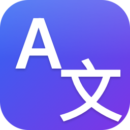
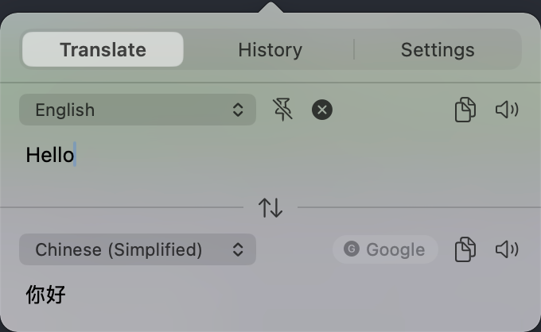
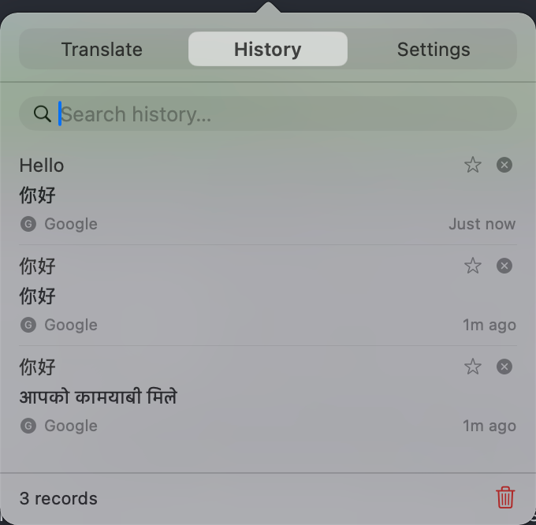
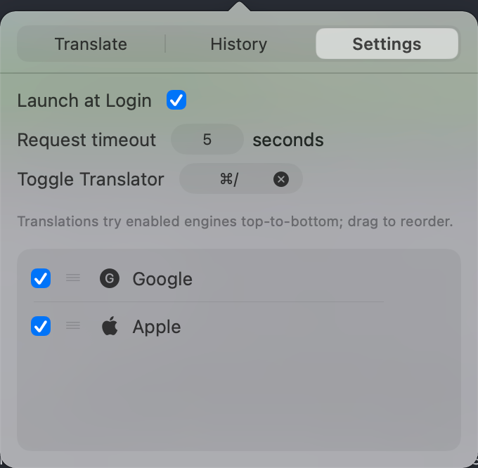
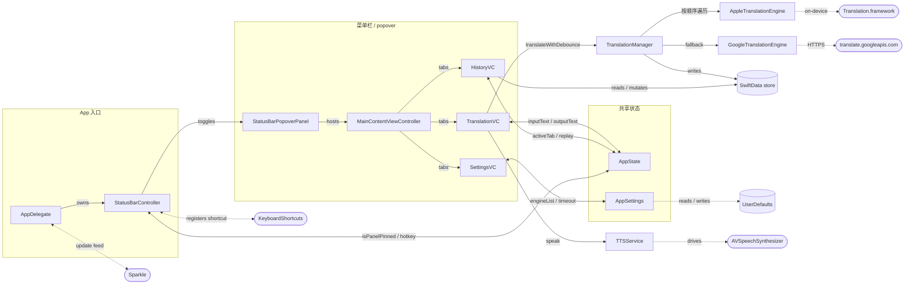

<p align="center">
  
</p>

<h1 align="center">LingoBar</h1>

<p align="center"><strong>原生的 macOS 菜单栏翻译工具，点一下就翻译，翻完就回去干活。</strong></p>

<p align="center">
  
  
  <br>
  
  
  
</p>

<p align="center"><a href="README.md">English</a> | <a href="README_ZH.md">中文</a></p>

---

## LingoBar 是什么

LingoBar 常驻 macOS 菜单栏。点击菜单栏图标，或按下全局快捷键（默认 `⌥⌘T`），一个 popover 从菜单栏下方弹出，输入框已经自动获得焦点。打字、停下约 500 ms，翻译就出现在输出框里。再按一次快捷键（或 `⌘W`、`Esc`、点窗口外）即可关闭。整个产品就这么简单：开箱即用、一个 popover、不抢 Dock、不留窗口。

```
   ╭─ 菜单栏 ─────────────────────────╮
   │  ... [🌐 LingoBar]  🔋  ⌚ 14:23  │
   ╰─────────────╲────────────────────╯
                  ▼  点击 / ⌥⌘T
   ┌─[  翻译   │   历史   │   设置   ]┐
   │ 自动检测 ▾                        │
   │  Bonjour le monde            📋🔊 │
   │ ─────────────────────────── 🍎 Apple
   │ 自动 ▾                            │
   │  你好，世界                  📋🔊 │
   └───────────────────────────────────┘
```

## 功能特性

- **纯原生、无 WebView** — Swift 6 + AppKit，跟随系统浅色 / 深色，藏 Dock（`LSUIElement`），以普通 `NSStatusItem` 形式常驻菜单栏。
- **零配置即可翻译** — 默认启用 Apple 离线 Translation 框架；Google 翻译走其公开网页端点，免 API Key、免登录、免绑卡。
- **引擎自动 fallback** — 设置页可勾选 / 拖拽排序引擎；超时（默认 5s）或失败时自动切到下一个已勾选引擎，输出区右上角的引擎图标随之更新为实际生效的引擎。
- **实时 debounce 翻译** — 停止输入约 500 ms 自动触发翻译；中途继续打字会取消上一个未完成的请求。
- **历史会话聚合** — 一段连续输入只生成一条历史记录，会话内的多次重译就地更新这条记录，不会刷出一堆中间态；星标条目自动浮到顶部，500 条上限不淘汰收藏。
- **可锁定窗口** — 输入区右侧的 pin 按钮锁定窗口，点击外部 / `Esc` 不再关闭，便于长时间对照查看。
- **列表内拖拽** — 引擎排序使用自实现的鼠标追踪，拖动锁定垂直轴，永远不会跑出 popover。
- **自定义全局快捷键** — 录制器嵌在设置页（基于 [KeyboardShortcuts](https://github.com/sindresorhus/KeyboardShortcuts)），默认 `⌥⌘T`。
- **Sparkle 自动更新** — 通过菜单栏右键菜单检查更新、下载、安装。

## 截图

<p align="center">
  
  
  
</p>

## 安装

### macOS（15.0+，Apple Silicon）

> 当前发布版本未做正式签名（仅本地 ad-hoc 签名），首次启动会被 Gatekeeper 拦下。绕过一次后，后续启动就和签名 App 无异。

#### 方式 1 — 右键打开

1. 从 Releases 下载最新的 `LingoBar.dmg`，将 `LingoBar.app` 拖入 `/Applications`。
2. 在 Finder 中右键 `LingoBar.app` → **打开**。
3. 弹窗会多出一个 **打开** 按钮，点它即可。系统会记录这次例外，之后双击就能直接启动。

#### 方式 2 — 系统设置放行

1. 双击一次 `LingoBar.app`，关掉 "无法打开" 对话框。
2. 打开 **系统设置 → 隐私与安全性**，滚动到底部。
3. 在 LingoBar 那行右侧点 **仍要打开**，再次确认即可。

#### 方式 3 — 去掉隔离属性

```bash
# 把 LingoBar.app 拖进 /Applications 之后：
xattr -cr /Applications/LingoBar.app
```

这一步移除 Gatekeeper 用来识别"从网络下载"的 `com.apple.quarantine` 扩展属性，之后可以像签名 App 一样直接启动。

## 使用说明

- **打开 / 关闭** — 点击菜单栏图标，或按全局快捷键（默认 `⌥⌘T`）。两者都是 toggle，共用同一个窗口实例。
- **翻译** — 在输入框中输入文本，停顿约 500 ms 自动触发翻译。输出区右上角的图标显示本次实际返回结果的引擎（按设置页的列表从上到下尝试，超时或出错自动切到下一个已勾选引擎）。
- **目标语言"自动"** — 输入中文 → 输出英文，输入其他 → 输出中文。选定具体语言则锁定该语言。
- **锁定窗口** — 点击输入区右侧的 pin 按钮，窗口在点击外部 / 按 `Esc` 时不再关闭。锁定状态不跨 App 重启保留。
- **3 分钟保留** — 关闭窗口后 3 分钟内重新打开，输入 / 输出 / Tab 都保留；超出 3 分钟则清空输入并把 Tab 重置为"翻译"。
- **历史** — 切到 **历史** Tab 可搜索 / 收藏 / 删除单条 / 点击回填到翻译 Tab。"清空全部"不会删除收藏。
- **设置** — 菜单栏右键的 **设置…** 直接唤起翻译窗口并切到设置 Tab。可开关登录时启动、修改全局快捷键、调整请求超时、勾选 / 拖拽排序引擎（拖动锁垂直轴）。

## 开发

> 本项目仅提供 macOS 构建步骤。整套构建基于 Xcode 工程 + SwiftPM 依赖，不为其他平台提供构建说明。

### 推荐开发环境

| 依赖                       | 版本     |
| -------------------------- | -------- |
| macOS                      | 26.4.1   |
| Xcode                      | 26.4.1   |
| Xcode Command Line Tools   | 26.4.1   |

<sub>这是作者本机用于日常开发与运行 LingoBar 的环境，保证可以从源码 build 到运行打开。低于此版本或许也能跑，但未经实测，对效果不做保证。</sub>

### 前置环境检查与配置

#### macOS

- **检查当前版本** — 顶部 **Apple 菜单 → 关于本机**，或终端运行 `sw_vers -productVersion`。
- **升级** — **系统设置 → 通用 → 软件更新**（推荐；Apple 官方通道，会顺带把项目依赖的系统框架升级到匹配版本）。

#### Xcode + Command Line Tools

- **检查 Xcode 是否安装** — 用 Spotlight 搜 "Xcode"，或终端运行 `xcode-select -p`（输出路径即说明 CLT 已注册）。
- **检查 Xcode 版本** — `xcodebuild -version`。
- **检查 CLT 版本** — `pkgutil --pkg-info=com.apple.pkg.CLTools_Executables`。
- **安装 Xcode** — **Mac App Store**（推荐；自动跟版本，会一并装好对应的 CLT）。
- **单独安装 / 注册 Command Line Tools** — `xcode-select --install`。装完 Xcode 后再跑一次 `sudo xcode-select -s /Applications/Xcode.app/Contents/Developer`，把命令行工具切到 Xcode 自带的 toolchain。
- **升级** — Xcode 走 Mac App Store；CLT 走 **系统设置 → 通用 → 软件更新**。

Swift 6.3 已经随 Xcode 26 一同装好，不用单独装 Swift toolchain。SwiftPM 依赖（Sparkle、KeyboardShortcuts）会在第一次用 Xcode 打开工程时自动解析。

### 构建与运行

```bash
# 1. 克隆并进入项目
git clone https://github.com/yuman07/LingoBar.git
cd LingoBar

# 2. 用 Xcode 打开 — 第一次打开时 SwiftPM 会自动拉 Sparkle 和 KeyboardShortcuts
open LingoBar.xcodeproj

# 3. 在 Xcode 中选 LingoBar scheme，⌘R 直接 build & run。
```

如果不想开 Xcode，仅命令行 Debug build：

```bash
xcodebuild -project LingoBar.xcodeproj -scheme LingoBar -configuration Debug \
  -derivedDataPath build build
open build/Build/Products/Debug/LingoBar.app
```

## 技术总览

LingoBar 是单二进制 AppKit App：藏 Dock，全部 UI 集中在一个挂在状态栏图标下的 popover 风格 `NSPanel` 里。Popover 内是一个自绘的分段 Tab 栏（翻译 / 历史 / 设置），分别由三个平级的 view controller 持有，Tab 状态挂在共享的 `AppState` 上。翻译请求由 `TranslationManager` debounce，按用户配置的引擎顺序在共享超时下逐个尝试，失败 / 超时则切到下一个，最终成功的引擎图标会同步显示到输出区右上角。历史记录写入 SwiftData，按"输入会话"聚合（一段连续输入只产出一条 row 并就地更新），上限 500 条且收藏不计入淘汰。设置写入 `UserDefaults`；全局快捷键由 Sindresorhus 的 `KeyboardShortcuts` 注册并实时同步到菜单栏右键菜单的快捷键提示；自动更新由 Sparkle 接管。

### 技术栈

| 关注点         | 选型                                                                                |
| -------------- | ----------------------------------------------------------------------------------- |
| 平台           | macOS 15.0+（仅 Apple Silicon，ARM64）                                              |
| 语言           | Swift 6，启用 `SWIFT_STRICT_CONCURRENCY = complete`                                 |
| UI             | AppKit（`NSViewController` / `NSView`），无 SwiftUI、无 WebView                     |
| 翻译引擎       | Apple `Translation` 框架（离线）；Google `translate.googleapis.com` 公开端点         |
| 持久化         | `UserDefaults`（设置）；SwiftData（历史）                                           |
| 全局快捷键     | [KeyboardShortcuts](https://github.com/sindresorhus/KeyboardShortcuts)（Sindresorhus） |
| 自动更新       | [Sparkle](https://github.com/sparkle-project/Sparkle)                               |
| 登录项         | `ServiceManagement.SMAppService`                                                    |
| 朗读           | `AVSpeechSynthesizer`                                                               |
| 分发           | 独立 DMG，无 sandbox，Developer ID + 公证（计划中）                                 |

### 架构图



- **主数据流** — `TranslationVC` 把用户输入写到 `AppState.inputText`；`TranslationManager` 通过订阅 debounce ~500 ms，按用户配置的活动引擎顺序在共享超时下尝试翻译，胜出引擎的文本与图标写回 `AppState.outputText` / `currentEngineType`。
- **引擎 fallback** — `TranslationManager` 串行运行 `AppEng → GoogleEng`（或用户在设置中配置的顺序），共享 `AppSettings.engineTimeoutSeconds` 作为单次超时；某个引擎失败或超时即切到下一个已勾选引擎；输入清空时活动引擎重置为列表首项。
- **外部服务** — `KeyboardShortcuts` 拥有全局快捷键和 `StatusBarController` 的双向同步；`Sparkle` 在启动时挂载更新源；Apple `Translation` 框架在端上运行，遇到"语言包未安装"也按普通引擎失败处理由下一个引擎接手。
- **持久化** — `UserDefaults` 承载 `AppSettings`（引擎顺序、勾选集、超时、语言偏好、快捷键 ID）；SwiftData 承载 `TranslationRecord`，驱动历史 Tab 的搜索与收藏。两者刻意分离：设置启动时秒读，历史不会卡住 popover 弹出。

### 源码目录

```
LingoBar/
|-- LingoBarApp.swift            # @main，交给 AppDelegate
|-- AppDelegate.swift            # NSApplicationDelegate，Sparkle 接线
|-- AppState.swift               # @MainActor ObservableObject，运行时瞬时状态
|-- AppSettings.swift            # @MainActor，UserDefaults 支撑的设置
|-- LingoBar.entitlements        # 仅 network.client（无 sandbox）
|-- Localizable.xcstrings        # en + zh-Hans
|-- Models/
|   |-- SupportedLanguage.swift     # 22 种语言 + auto
|   `-- TranslationRecord.swift     # SwiftData @Model，历史条目
|-- Services/
|   |-- TranslationEngineProtocol.swift  # 引擎契约 + TranslationError
|   |-- TranslationManager.swift         # debounce、fallback 链、写历史
|   |-- AppleTranslationEngine.swift     # 包装 Translation.framework
|   |-- AppleTranslationHost.swift       # 框架要求的 SwiftUI host
|   |-- GoogleTranslationEngine.swift    # 公开 translate.googleapis.com 客户端
|   `-- TTSService.swift                 # AVSpeechSynthesizer 包装
|-- StatusBar/
|   |-- StatusBarController.swift        # NSStatusItem + popover toggle + 右键菜单
|   `-- StatusBarPopoverPanel.swift      # 切成 popover 形状的 NSPanel
|-- Utilities/
|   `-- KeyboardShortcutNames.swift      # KeyboardShortcuts.Name 注册
`-- Views/
    |-- MainContentViewController.swift  # Tab 容器 + 自绘分段控件
    |-- TranslationViewController.swift  # 翻译 Tab
    |-- HistoryViewController.swift      # 历史 Tab（SwiftData 支撑）
    |-- SettingsViewController.swift     # 设置 Tab 顶部行 + 胶囊
    |-- EngineSettingsViewController.swift  # 引擎列表 + 自实现拖拽排序
    |-- LanguagePopUpButton.swift        # 自绘的语言选择下拉
    `-- GrowingTextView.swift            # 自动撑高的输入 / 输出文本框
```

### 引擎 fallback 算法

`TranslationManager` 把引擎列表视为一个有序、可部分勾选的序列。涉及的实体不多，先列清楚：

| 概念             | 来源                                                   | 约束                                                       |
| ---------------- | ------------------------------------------------------ | ---------------------------------------------------------- |
| 引擎列表         | `AppSettings.engineList`                               | 始终包含全部受支持引擎；用户控制顺序。                     |
| 已勾选引擎集     | `AppSettings.enabledEngines`                           | 列表的子集；UI 保证 `count ≥ 1`。                          |
| 活动引擎         | `AppState.currentEngineType`                           | 输入清空时重置为第一个已勾选引擎。                         |
| 单次请求超时     | `AppSettings.engineTimeoutSeconds`（默认 5，最小 1）   | 多引擎共用；按"每次尝试"计算，不是"整条链路"。             |

每次翻译尝试：

1. **跳过未勾选引擎** — 遍历 `engineList` 时把不在 `enabledEngines` 中的项过滤掉。*为何这样：* 顺序是用户的偏好，但已禁用的引擎不该出现在链路里，否则排序 UX 会和勾选 UX 耦合。
2. **从活动引擎开始** — 第一个尝试的引擎永远是 `currentEngineType`。*为何这样：* 用户在一段会话中期望翻译继续来自上一次成功的引擎；切换引擎应当是 "fallback" 行为而不是默认。
3. **失败即下沉** — 错误或超时即按 `engineList` 顺序换到下一个已勾选引擎。*为何这样：* 用户排序就是用户偏好的体现，尊重它比任何"成本最优 / 速度最优"自作聪明的策略都更可预测。
4. **胜出者上位** — 真正返回结果的引擎成为新的 `currentEngineType`，图标同步刷到输出区。*为何这样：* 让 fallback 行为可观察，向用户传递"首选引擎刚才失败了"的被动信号；如果不是用户想要的，他可以去设置页改顺序。
5. **空输入即重置** — 输入清空时（手动清、3 分钟过期清、点击历史回填等）把 `currentEngineType` 重置为首个已勾选引擎。*为何这样：* 新一轮翻译该从用户的"首选项"开始，而不是继承上一轮的 fallback 残留。
6. **全部失败要可见** — 所有已勾选引擎都失败时直接展示 `allEnginesFailed`，绝不偷偷回退到非勾选引擎。*为何这样：* SPEC 明确禁止"隐藏兜底 Apple"——把 Apple 从勾选集移除就必须真的把它从链路移除，哪怕另一个引擎此刻断网。

复杂度：每次尝试 `O(k)`，`k` 是已勾选引擎数（不超过支持的引擎总数，目前 2）。共享超时挂在 manager 上，慢引擎不能阻塞链路超过 `engineTimeoutSeconds`。

### 自实现的列表内拖拽

引擎排序没有用 `NSDraggingSession`，所以拖动时被拖的行被锁在垂直轴上，永远跑不出 popover。流程：

1. **hit-test** — `EngineRowView.hitTest` 对勾选框以外的点击都返回 `self`，于是 handle / icon / label / padding 的点击都进入行的 `mouseDown`，而点在勾选框上仍然交给 `NSButton`。
2. **追踪循环** — `mouseDown` 把控制权交给父 VC：捕获鼠标在 window 坐标系的起始 Y 和行的 flipped origin-Y，进入 `window.nextEvent(matching: [.leftMouseDragged, .leftMouseUp], inMode: .eventTracking, dequeue: true)` 的事件循环。
3. **逐事件更新** — 每次 `mouseDragged` 计算 `dy = currentMouseY - startMouseY`，把 `row.frame.origin.y` 设为 `startFrameY - dy`，并 clamp 到 `[0, (count-1) * rowHeight]`。越过相邻行中点时移动可视顺序数组并动画补位其他行；被拖的行被排除在 layout 之外，避免和我们直接写的 frame 打架。
4. **`mouseUp` 提交** — 被拖的行用 18 ms 动画回弹到目标槽位；动画完成后再通过 `AppSettings.moveEngine(from:to:)` 提交模型修改。延后提交是为了避免 `@Published` 通知触发的重建打断回弹动画；index 转换处理了 `moveEngine` "drop above row N" 的语义，向下拖时要把 finalIndex 加 1。

效果是一个像系统设置那样的"列内重排"手感，但全程不会跑出窗口。

## 常见问题

**Q: Google 翻译需要 API Key 吗？**

> 不需要。Google 引擎走 `translate.googleapis.com/translate_a/single?client=gtx`，这是 Chrome 内置翻译用的免认证端点，免 Key、免登录、免绑卡。要注意：这是非官方文档化的端点，理论上随时可能改动；这也是默认还有 Apple 兜底的原因之一。

**Q: 为什么没有 Dock 图标？**

> LingoBar 是菜单栏工具，`Info.plist` 里的 `LSUIElement` 把它从 Dock 和 ⌘-Tab 切换器中隐藏掉。状态栏图标是它对外的唯一入口。

**Q: 为什么只支持 Apple Silicon？**

> 工程里 `ARCHS = arm64`，SPEC 也明确只发布 ARM 版本；Apple `Translation` 框架在 Apple Silicon 神经引擎上跑得更顺。

**Q: 能再加一个翻译引擎吗？**

> 可以——实现 `TranslationEngineProtocol` 并在 `TranslationEngineType` 中加一个 case（带 `displayName` 和 `iconName`）。设置页会自动从 `allCases` 渲染新引擎。免 Key 公开端点候选：MyMemory（官方、有日配额）、Lingva（Google 代理）、DeepLX（DeepL Web 反代，比较脆弱）。

## 致谢

- [Sparkle](https://github.com/sparkle-project/Sparkle) — Mac App 自动更新框架。
- [KeyboardShortcuts](https://github.com/sindresorhus/KeyboardShortcuts)（Sindre Sorhus）— 全局快捷键录制。
- Apple [Translation 框架](https://developer.apple.com/documentation/translation) — 端上翻译引擎。

## License

基于 [MIT License](LICENSE) 分发。© 2026 yuman。
